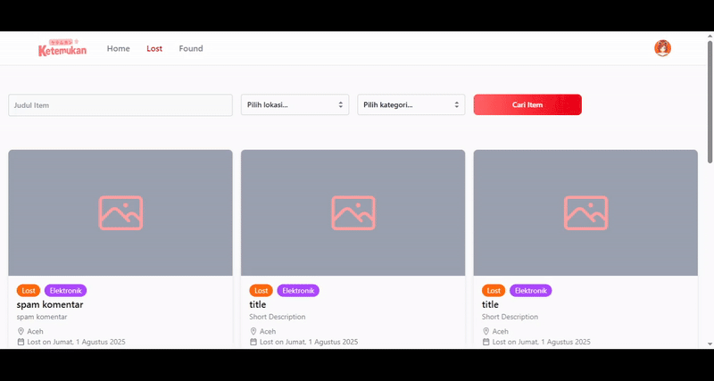

# 🔎 Ketemukan-FE


Ketemukan adalah aplikasi web yang dikembangkan untuk memudahkan siapa saja dalam melaporkan barang hilang atau barang temuan, kapanpun dan di manapun. Terinspirasi dari situasi nyata di mana orang sering kehilangan atau menemukan barang tanpa tahu harus melapor ke mana, Ketemukan hadir sebagai solusi digital. Bersama Ketemukan, pasti ketemu-kan

---

## 📑 Daftar Isi

- [🔎 Ketemukan-FE](#-ketemukan-fe)
  - [📑 Daftar Isi](#-daftar-isi)
  - [🚀 Fitur](#-fitur)
  - [🎬 Demo](#-demo)
  - [📁 Struktur Folder](#-struktur-folder)
  - [🛠️ Instalasi \& Konfigurasi](#️-instalasi--konfigurasi)
  - [🧰 Tech Stack / Dependencies](#-tech-stack--dependencies)
  - [🛎️ Tools](#️-tools)
  - [👨‍💻 Pengembang](#-pengembang)

---

## 🚀 Fitur

- Login/Register User
- Kelola User (update profile user)
- Post barang hilang atau barang ditemukan
- Lihat, cari, filter barang hilang atau barang ditemukan
- Lihat informasi detail dari item yang telah dipost
- Kelola item yang telah dipost (update/delete item)
- Berikan komentar atau informasi pada item yang telah dipost
- Raih point dan achievement dari post item atau komentar
- Tampilan kekinian dan responsive
- Error handling, jika ada form yang belum terisi atau ada kegagalan request

## 🎬 Demo

<details>
<summary>Demo (click me)</summary>

  <details>
  <summary>Login (click me)</summary>


  </details>

  <details>
  <summary>Filter (click me)</summary>



  </details>

  <details>
  <summary>Geolokasi (click me)</summary>


  </details>

  <details>
  <summary>Komentar (click me)</summary>


  </details>

   <details>
  <summary>Tambah Item (click me)</summary>


  </details>

</details>

## 📁 Struktur Folder

```

.
├── public/
│   └── images/             # Gambar statis seperti logo, notfound dsb
├── src/                    # Seluruh source code aplikasi
│   ├── assets/             # Asset statis seperti placeholder
│   ├── components/         # Komponen UI yang bisa digunakan ulang
│   ├── hooks/              # Custom React hooks
│   ├── pages/              # Komponen untuk setiap halaman
│   ├── styles/             # File css utama, yang didalamnya menggunakan import tailwind
│   └── utils/              # Fungsi helper atau utility seperti api, serta menampilkan tanggal dengan format yang mudah dibaca

```

## 🛠️ Instalasi & Konfigurasi

<details>
<summary>Instalasi & Konfigurasi (click me)</summary>

### 1. Clone repository ini

```
git clone https://github.com/husenmalik7/ketemukan-fe.git

```

### 2. Install repository

```
npm install

```

### 3. Jalankan server via start atau development

```
npm run start
or
npm run dev
```

</details>

## 🧰 Tech Stack / Dependencies

- [](https://www.npmjs.com/package/vite) **sebagai build tool, dalam kasus ini dengan react**
- [](https://www.npmjs.com/package/eslint) **sebagai linter, menandai jika ada error, variable ganda, dsb**
- [](https://www.npmjs.com/package/@headlessui/react) **digunakan sebagai komponen dropdown**
- [](https://www.npmjs.com/package/@tailwindcss/vite) **framework css utama dalam project ini**
- [](https://www.npmjs.com/package/tailwindcss) **framework css utama dalam project ini**
- [](https://www.npmjs.com/package/aos) **sebagai animasi fade up, down dan semacamnya, digunakan pada halaman home**
- [](https://www.npmjs.com/package/leaflet) **sebagai map interaktif pada halaman detail**
- [](https://www.npmjs.com/package/react-leaflet) **sebagai map interaktif pada halaman detail**
- [](https://www.npmjs.com/package/react) **framework frontend utama yang digunakan**
- [](https://www.npmjs.com/package/react-datepicker) **sebagai pemilih tanggal pada input form**
- [](https://www.npmjs.com/package/react-dom) **sebagai penghubung komponen react ke DOM**
- [](https://www.npmjs.com/package/react-icons) **sebagai penyedia icon-icon yang menarik**
- [](https://www.npmjs.com/package/react-router-dom) **untuk mengatur rooting**
- [](https://www.npmjs.com/package/react-spinners) **sebagai animasi untuk loading**
- [](https://www.npmjs.com/package/react-toastify) **sebagai alert jika terjadi error atau succes dalam melakukan aksi**

## 🛎️ Tools

- **VSCode** sebagai kode editor
- **Google Chrome** sebagai platform pengembangan dan memantau hasil secara visual

## 👨‍💻 Pengembang

[Husen Malik](https://github.com/husenmalik7)
